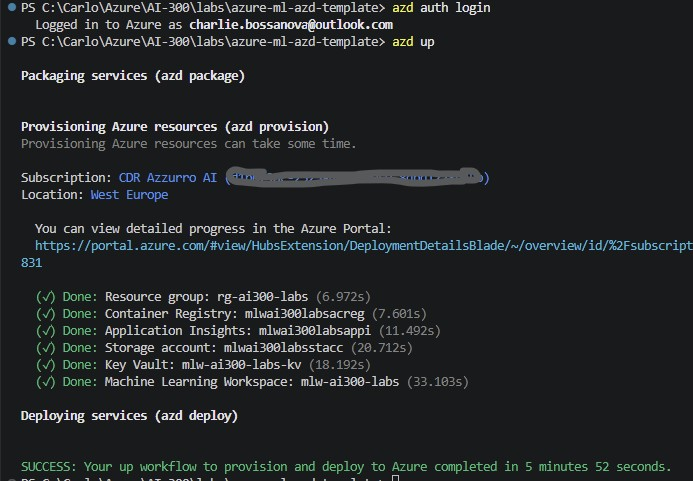
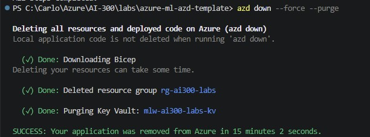

# azure-ml-azd-template

A Machine Learning project template for **Azure AI / Azure Machine Learning**, provisioned with the **Azure Developer CLI (`azd`)** using Bicep infrastructure-as-code. The template covers end-to-end ML workflows: environment provisioning, training job submission, model registration, and Responsible AI (RAI) pipeline execution.

---

## Table of Contents

- [Overview](#overview)
- [Repository Structure](#repository-structure)
- [Prerequisites](#prerequisites)
- [Infrastructure Setup](#infrastructure-setup)
- [Environment Variables](#environment-variables)
- [Running the ML Workflows](#running-the-ml-workflows)
- [Responsible AI Pipeline](#responsible-ai-pipeline)
- [Teardown](#teardown)
- [Screenshots](#screenshots)

---

## Overview

This template demonstrates how to use `azd` (Azure Developer CLI) with Bicep modules to provision a complete Azure Machine Learning workspace — including compute clusters and instances — and then orchestrate training jobs and Responsible AI evaluations from Python using the `azure-ai-ml` SDK.

Key capabilities:

- **Infrastructure as Code** via Bicep (`infra/`) with parameterised resource names
- **`azd`-driven provisioning** (`azd up`) and teardown (`azd down`)
- **Training job submission** using the Azure ML Job API
- **Model and dataset registration** for versioned asset management
- **Responsible AI dashboard** pipeline with cohort definitions and PDF report generation
- **Dependency management** via `uv` and `pyproject.toml` (Python 3.10)

---

## Repository Structure

```
azure-ml-azd-template/
├── azure.yaml                   # azd project manifest (Bicep provider)
├── pyproject.toml               # Python dependencies (uv-managed, Python 3.10)
├── infra/
│   ├── main.bicep               # Root Bicep template
│   ├── main.parameters.json     # Parameterised resource names (azd env vars)
│   ├── modules/
│   │   ├── workspace.bicep      # Azure ML Workspace
│   │   ├── compute-cluster.bicep
│   │   ├── compute-instance.bicep
│   │   └── environment.bicep    # Azure ML Environment definition
│   └── envs/
├── src/
│   ├── auth.py                  # Azure ML authentication helper
│   ├── register_data.py         # Data asset registration
│   ├── register_model_asset.py  # Model asset registration
│   ├── register_credit_dataset.py  # Credit dataset for RAI
│   ├── conda.yml                # Conda environment spec
│   ├── trainenv.yaml            # Azure ML training environment spec
│   ├── train/
│   │   ├── train.py             # Core training logic
│   │   ├── main_train.py        # Training entry point
│   │   ├── train_job.py         # Job submission (SDK v2)
│   │   └── create_job2.py       # Alternative job definition
│   └── rai/
│       ├── rai_pipeline.py      # Responsible AI pipeline
│       ├── cohorts.json         # RAI cohort definitions
│       └── pdf_gen.json         # RAI PDF report configuration
├── models/
├── images/
│   ├── Screenshot_AZD-up.jpg
│   └── Screenshot_AZD-down.jpg
└── notes.txt
```

---

## Prerequisites

| Tool | Purpose |
|------|---------|
| [Azure CLI (`az`)](https://learn.microsoft.com/cli/azure/install-azure-cli) | Azure authentication and role verification |
| [Azure Developer CLI (`azd`)](https://learn.microsoft.com/azure/developer/azure-developer-cli/install-azd) | Infrastructure provisioning (`azd up / down`) |
| [Python 3.10](https://www.python.org/) | Runtime (managed by `uv`) |
| [`uv`](https://github.com/astral-sh/uv) | Fast Python package and environment manager |

> **Update `azd` on Windows:**
> ```powershell
> winget upgrade Microsoft.Azd
> ```

---

## Infrastructure Setup

Follow these steps in order to provision the Azure ML workspace and associated resources.

### 1. Authenticate

```powershell
# Verify your Azure CLI login and active subscription
az login

# Authenticate with the Azure Developer CLI
azd auth login
```

### 2. Configure the Environment

```powershell
# Set the target subscription
azd env set AZURE_SUBSCRIPTION_ID <your-subscription-id>

# When prompted, provide an environment name
# Example: azure-ml-azd-template
```

> **Tip:** If you edit the `.env` file manually, refresh the azd environment state:
> ```powershell
> azd env refresh
> ```

### 3. Validate the Deployment

Perform a dry-run to check what will be provisioned before committing:

```powershell
azd provision --preview
```

> **Permission check:** Your account needs at minimum `Contributor` or `Azure AI Owner` on the target subscription. To verify:
> ```powershell
> az role assignment list \
>   --assignee <your-upn> \
>   --subscription <your-subscription-id> \
>   --output table
> ```

### 4. Deploy

```powershell
azd up
```

This provisions all Bicep-defined resources (ML Workspace, Compute Cluster, Compute Instance, Environment) and sets up the `azd` environment.

---

## Environment Variables

The Bicep parameter file (`infra/main.parameters.json`) consumes these `azd` environment variables:

| Variable | Description |
|----------|-------------|
| `AZURE_RESOURCE_GROUP` | Target resource group name |
| `AZURE_LOCATION` | Azure region (e.g. `switzerlandnorth`) |
| `AZURE_ML_WORKSPACE` | Azure ML workspace name |
| `AZURE_COMPUTE_CLUSTER` | Compute cluster name |
| `AZURE_COMPUTE_INSTANCE` | Compute instance name |
| `AZURE_ENVIRONMENT_NAME` | Azure ML environment name |

Set values with `azd env set <KEY> <VALUE>` or by editing the `.azure/<env-name>/.env` file.

---

## Running the ML Workflows

All Python commands use `uv run` to ensure the correct managed Python 3.10 environment is used.

### Register Data

```powershell
uv run python -m src.register_data
```

### Submit Training Jobs

```powershell
# Primary training job (SDK v2 pipeline)
uv run python -m src.train.train_job

# Alternative job definition
uv run python -m src.train.create_job2
```

### Register Model Asset

```powershell
uv run python -m src.register_model_asset
```

---

## Responsible AI Pipeline

The RAI pipeline uses the `raiwidgets` and `responsibleai` libraries to compute model explanations, error analysis, and fairness metrics, then generate a dashboard and PDF report.

### 1. Register the Credit Dataset

```powershell
uv run python -m src.register_credit_dataset
```

### 2. Run the RAI Pipeline

```powershell
uv run python -m src.rai.rai_pipeline
```

The pipeline is configured by:
- `src/rai/cohorts.json` — defines population cohorts for disaggregated analysis
- `src/rai/pdf_gen.json` — controls the RAI PDF report layout and content

---

## Teardown

To **delete all provisioned Azure resources** (including the workspace and all compute):

```powershell
azd down --force --purge
```

> ⚠️ `--purge` permanently removes soft-deleted resources (e.g. Key Vault). Use with care.

---

## Screenshots

### `azd up` — Provisioning Complete



### `azd down` — Teardown Complete



---

## Python Dependencies

Managed via `uv` and declared in `pyproject.toml`:

| Package | Version constraint | Purpose |
|---------|-------------------|---------|
| `azure-ai-ml` | `>=1.16.0` | Azure ML SDK v2 |
| `raiwidgets` | `==0.36.0` | Responsible AI widgets |
| `responsibleai` | `==0.36.0` | RAI computation engine |
| `pandas` | `<2.0.0` | Data manipulation |
| `numpy` | `<=1.26.2` | Numerical computing |
| `scikit-learn` | `<=1.2.2` | ML training |
| `matplotlib` | `<4.0.0` | Visualisation |

Install all dependencies:

```powershell
uv sync
```

---

*Part of the AI-300 labs series.*
